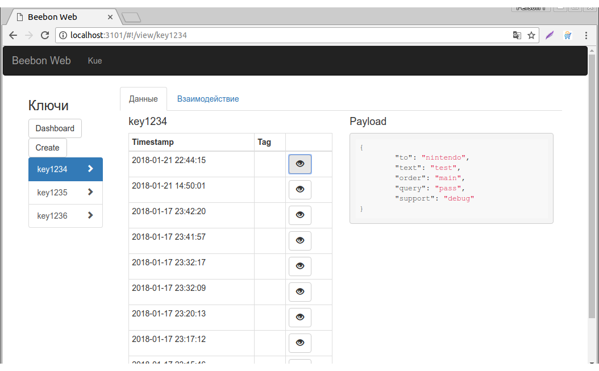

# beebon

Collect data &amp; run tasks - simple, fast, robust

# features

- simple log data by keys

- task running for any keys

- support swagger spec

- json payload

- web ui

- redis queues with kue-ui

- mysqldb storage

- graphics for each key

# ui

# run

use docker-compose.yml for up service under docker

